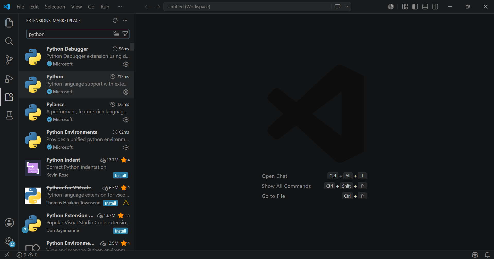
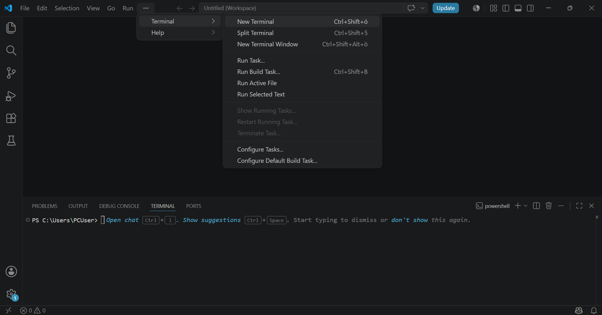

# Virtual Environment Setup

## Prerequisites

- Python 3.12.x or higher installed and added to PATH. If not then [Download Python for Windows](https://www.python.org/downloads/windows/)
- Visual Studio Code installed and added python extension. If not then [Download VSCode for Windows](https://code.visualstudio.com/download)
- Python Extension: 
 

## Virtual Environment Setup Steps

Run the following commands in VSCode terminal.


### Step 1 - Create the Virtual Environment
```powershell
python -m venv .venv
```
---
### Step 2 - Activate the Virtual Environment
```powershell
.\.venv\Scripts\Activate.ps1
```
> **Note:** If you encounter an execution policy error, run the following first:
> ```powershell
> Set-ExecutionPolicy -ExecutionPolicy RemoteSigned -Scope CurrentUser
> ```
---
### Step 3 - Run .toml file
```powershell
pip install -e .
```
---
### Optional Steps:
### Verify Installation
```powershell
pip list
```

### Deactivate the Environment
```powershell
deactivate
```
Now, you can run the kombiblock_gui.py file in your system after setting up the PLC as OPC UA server. 

# PLC Configuration for OPC UA Communication

- Add device. Select CPU which supports OPC UA communication
- Make S7-GRAPHS for process control logic
- Make sure all the variables are readable and writable in the db
- Select PLC -> Properties -> OPC UA -> Server
1. Activate OPC UA Server
2. Go to Runtime License and add suitable license
3. Note the server address. If connection is not established then you can change the port number.
4. Security: Only No Security
5. Select server certificate and add OPC UA 1-2 certificate
6. Select trusted client
7. Right click on the project -> Properties -> Protection -> Select the option
8. Select PLCSIM Virtual Ethernet Adapter
9. Add PLC instance. Enter IP and Subnet mask: 255.255.255.0
10. Start the instance

# [UAExpert](https://www.unified-automation.com/downloads/opc-ua-clients.html#c598) for Troubleshooting 

- Add new server
- Add config name
- Go to Advanced
- Add Endpoint URL then OK.
- Trust Server Certificate and Continue
- Check address space
- Note down the node ids